# 3D Vision Benchmarking: Visual SLAM vs. SfM

## Overview

This project evaluates two popular 3D reconstruction pipelines—**ORB-SLAM2** and **COLMAP**—on **custom-recorded indoor and outdoor datasets**, focusing on pose estimation accuracy, 3D reconstruction quality, and robustness under varied conditions. The results demonstrate the complementary strengths of offline SfM (COLMAP) and real-time monocular SLAM (ORB-SLAM2) through systematic experiments and trajectory comparisons using the EVO evaluation toolkit.

## Dataset Details

### 🏠 Indoor Sequence

- **Location**: UCL One Pool Street Common Room  
- **Device**: Samsung S23 Ultra  
- **Resolution**: 1920×1080 (Full HD)  
- **FPS**: 6  
- **Trajectory**: Loop with sharp meanders  
- **Intrinsics**: Estimated using COLMAP (OPENCV model)  

### 🏚️ Outdoor Sequence

- **Location**: Abandoned house surroundings  
- **Device**: DJI Mini 4 Pro  
- **Resolution**: 1920×1080 (downsampled from 4K)  
- **FPS**: 5  
- **Trajectory**: Circular drone path  
- **Intrinsics**: Estimated via COLMAP (OPENCV model) 

## Evaluation Tools

- Converted all trajectories to **TUM format**  
- Used [**EVO Toolkit**](https://github.com/MichaelGrupp/evo):
  - \`evo_traj\`: Scale aligned trajectory comparisons
  - RPY and velocity plots for both sequences  

## Indoor Dataset Results

The indoor sequence was recorded using a handheld smartphone capturing a rich textured environment with furniture, pool table, sofas, and potted trees. We deliberately included sharp, meandering curves to test camera pose tracking robustness and extracted around ~600 frames at 6 FPS. We carefully controlled camera parameters (resolution, focus, exposure) using the `Open Camera` application to ensure optimal data collection, maintaining consistent settings throughout capture.

    

### COLMAP Reconstruction Strengths
- **Dense Point Cloud**: Successfully reconstructed detailed furniture outlines and room layout
- **Feature-rich Areas**: Excellently captured textured surfaces with clear boundaries
- **Geometric Consistency**: Maintained accurate spatial relationships between objects
- **Complete Trajectory**: Preserved all camera poses throughout the meandering path

    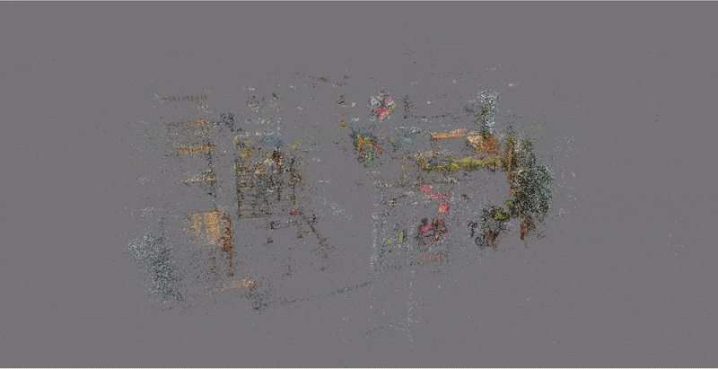
    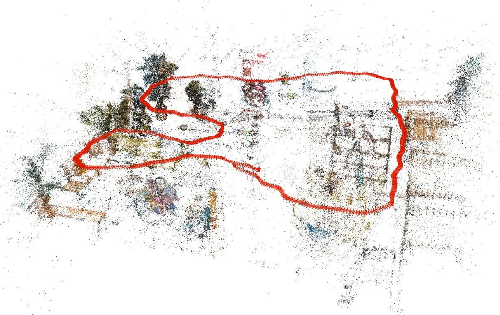

### ORB-SLAM2 Localization Performance
- **Real-time Tracking**: Maintained robust pose estimation despite challenging camera motions
- **Initialization**: Successfully initialized after approximately 19 frames (3 seconds)
- **Feature Management**: Effectively tracked 1000 ORB features per frame
- **Loop Closure**: Accurately detected and corrected drift when returning to previously visited areas

    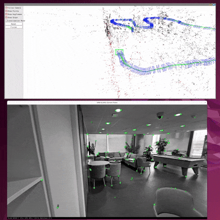

### Comparative Analysis
- **Trajectory Alignment**: After initialization, both systems showed excellent trajectory agreement
- **Velocity Profile Comparison**: Nearly identical velocity profiles with RMS difference of only 0.05 m/s
- **Attitude Estimation**: Consistent roll, pitch, and yaw angles throughout the sequence

    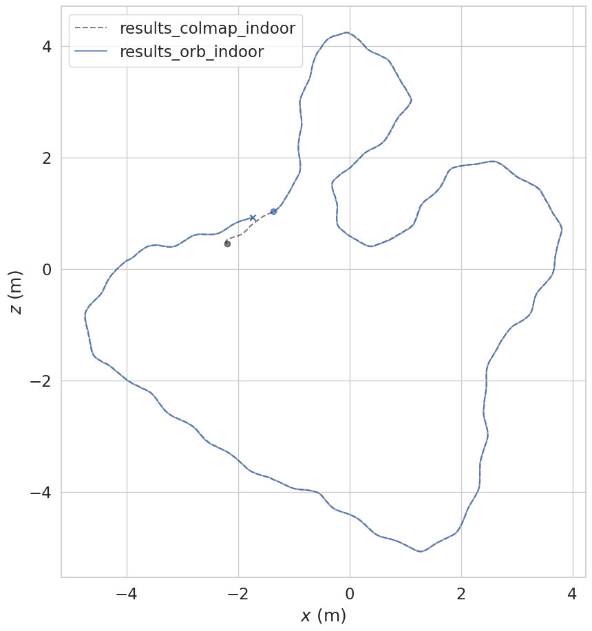
    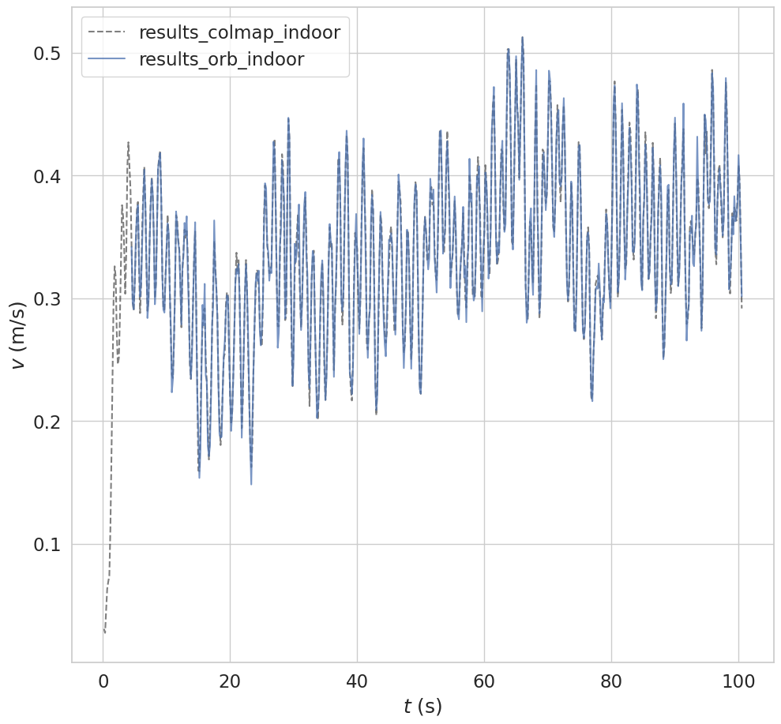

    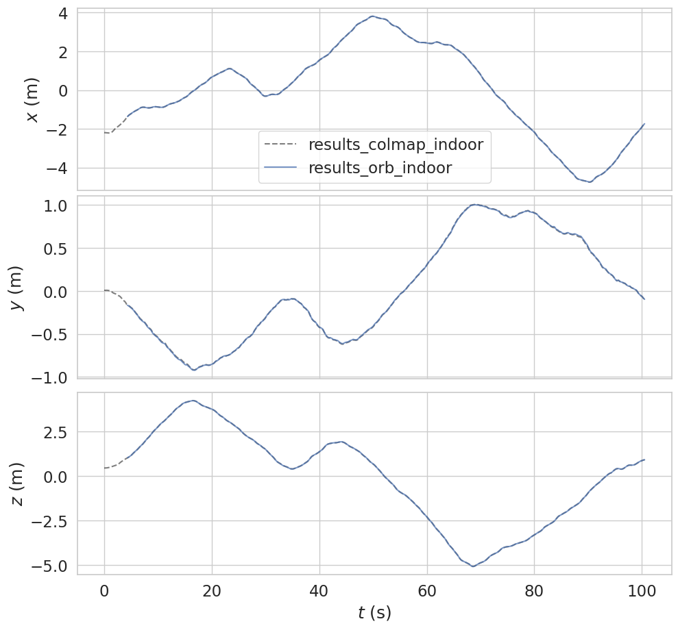
    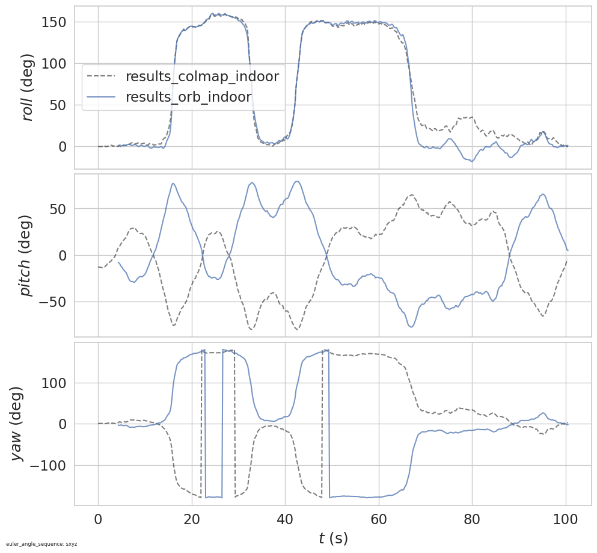

## Outdoor Dataset Results

The outdoor sequence was captured around an abandoned house structure using a DJI Mini 4 Pro drone, providing an aerial perspective with stable motion and visible loop closure opportunities. We made the flight have a slow circular motion to ensure good feature overlap and locked camera parameters.

    

### COLMAP Reconstruction Excellence
- **Architectural Detail**: Captured fine structural elements like window frames and roof ridges
- **Point Cloud Density**: Generated ~300K points in sparse mode and 4.5M points in dense reconstruction
- **Textured Surfaces**: Successfully recovered facade details despite varied lighting conditions
- **Building Footprint**: Accurately preserved overall structure dimensions and perimeter

    
    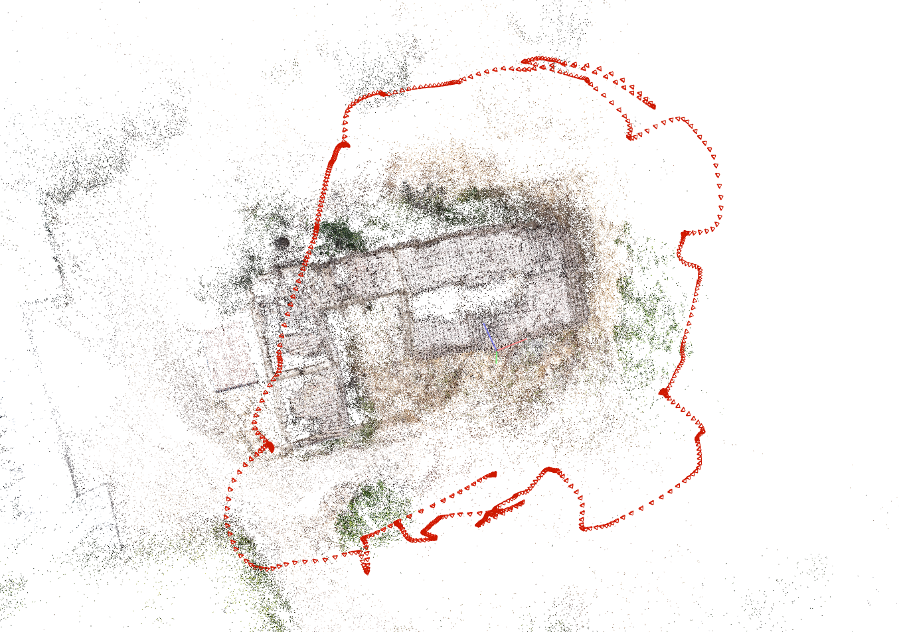

### ORB-SLAM2 Localization Strengths
- **Fast Initialization**: System initialized successfully after only 8 frames (1.6 seconds)
- **Real-time Processing**: Maintained tracking throughout the full flight path
- **Robust Feature Tracking**: Effectively managed 2000 ORB features per frame
- **Drift Correction**: Successfully performed loop closure when returning to start position

    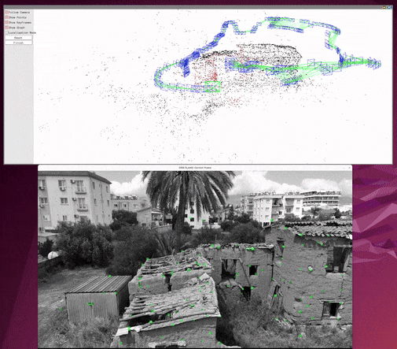

### Comparative Analysis
- **Trajectory Consistency**: After alignment, trajectories showed sub-meter agreement
- **Velocity Profile**: Nearly identical speed measurements with RMS difference of 0.07 m/s
- **Elevation Handling**: COLMAP captured the full ~7m elevation change, while ORB-SLAM2 showed slight underestimation due to monocular scale drift
- **GPS Comparison**: COLMAP's trajectory closely matched drone's onboard GPS with maximum lateral deviation of 1-2m

    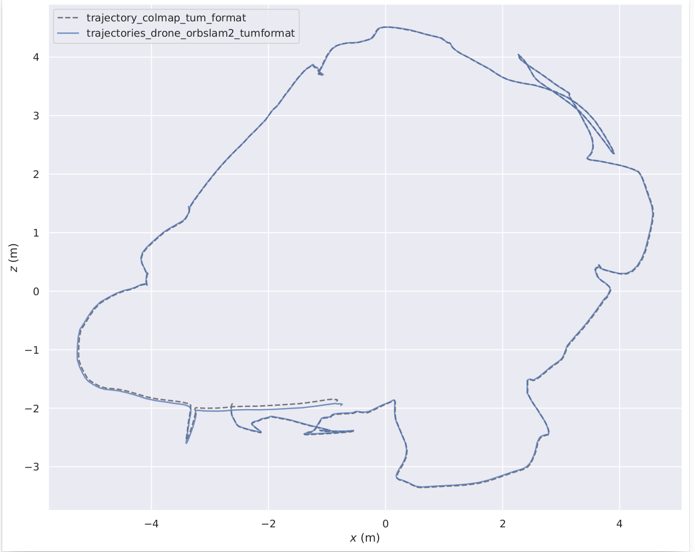
    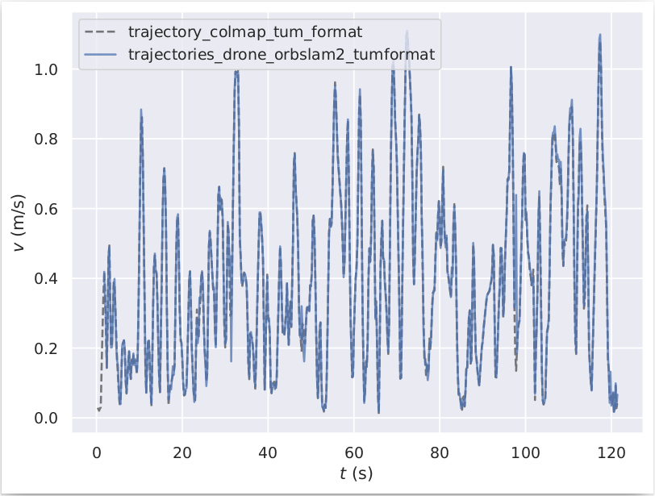

    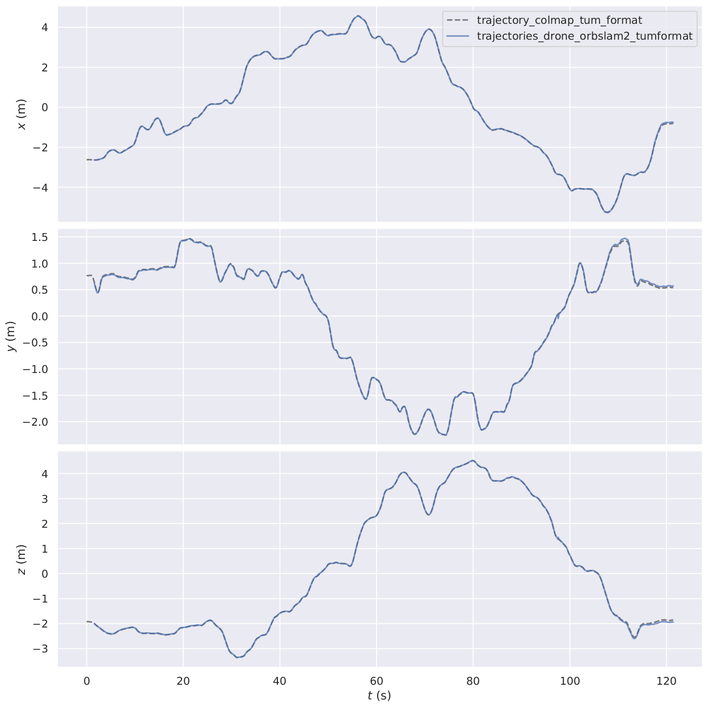
    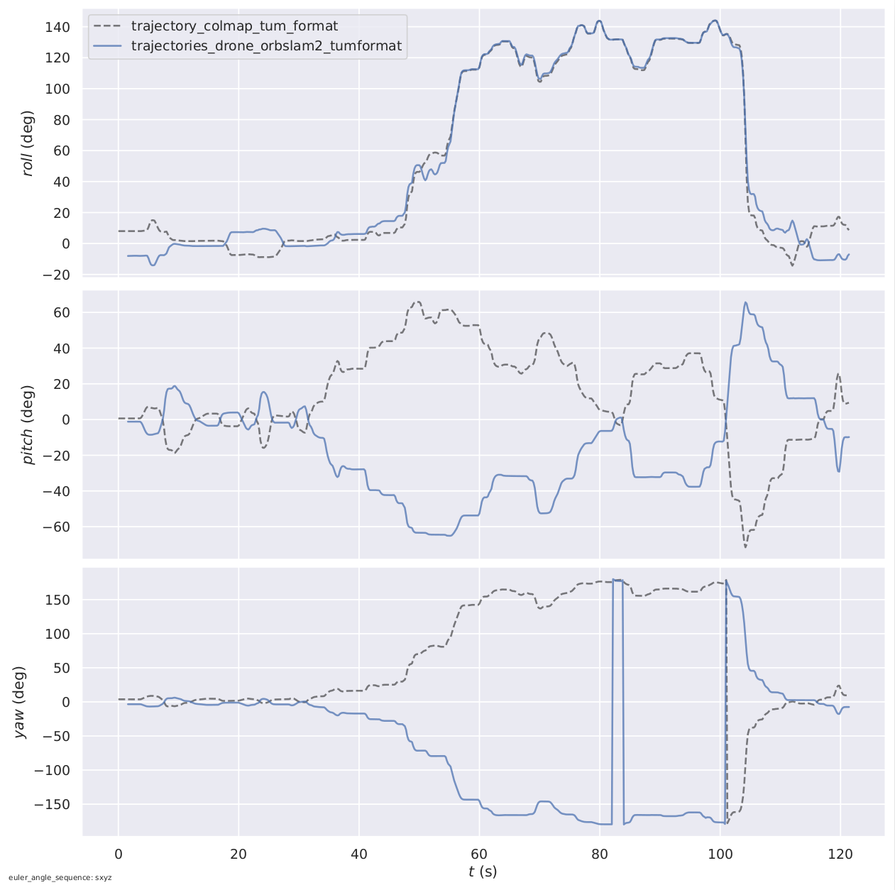

## Dense Reconstruction Extension (Outdoor Only)

We developed a complete dense 3D reconstruction pipeline that transforms sparse point clouds into fully textured, watertight meshes suitable for heritage documentation and virtual exploration.

### Dense Reconstruction Pipeline
1. **Patch-based Stereo Matching**: Generated per-view depth maps using COLMAP's `patch_match_stereo` on undistorted images
2. **Depth Map Processing**: Created one depth and normal map per key-frame, capturing fine details like roof-tile ridges and window recesses
3. **Photometric Depth Fusion**: Merged all depth maps with `stereo_fusion` into a unified colored point cloud containing ~4.5M points
4. **Poisson Surface Reconstruction**: Converted the fused cloud into a watertight triangular mesh with 1.65M vertices and 3.29M faces

    
    

### Heritage Preservation Applications
This high-fidelity reconstruction pipeline offers significant value for cultural heritage preservation:

- **Digital Archiving**: Creates "digital twins" of structures for long-term preservation against decay
- **Condition Monitoring**: Enables precise measurement of structural changes through periodic rescans
- **Virtual Restoration**: Provides a foundation for simulating restoration efforts before physical intervention
- **Public Engagement**: Allows remote exploration of photorealistic site replicas without risking damage to fragile structures

The pipeline successfully recovers contiguous facades, tile patterns, and ground topology despite challenges like heavy roof collapse and vegetation occlusion. The result is a survey-grade model with sub-10cm architectural detail preservation, suitable for professional documentation and analysis.

## Challenges Addressed
- **Scale Ambiguity**: Addressed the inherent scale ambiguity in monocular vision through careful alignment
- **Initialization**: Tuned parameters to ensure robust system initialization with minimal delay
- **Computation Time**: Balanced reconstruction quality with processing requirements through optimal frame sampling
- **Camera Calibration**: Leveraged COLMAP's robust intrinsic parameter estimation for consistent camera models

## Conclusion
This project demonstrates that COLMAP and ORB-SLAM2 represent complementary approaches to visual scene understanding. COLMAP excels in offline, high-fidelity reconstruction, while ORB-SLAM2 provides indispensable real-time tracking capabilities. Together, they enable a powerful workflow for robotics, augmented reality, and digital preservation applications.

## Team and Attribution
- Amlan Sahoo - MSc Robotics and AI, UCL
- Lorenzo Uttini - MSc Robotics and AI, UCL
- Ziya Ruso - MSc Robotics and AI, UCL

*This project was completed as part of the COMP0249 Computer Vision and Robot Perception 2025 coursework at University College London.*

## Additional Resources

### ORB-SLAM2 Run Video
For a complete demonstration of the ORB-SLAM2 run, watch the video here: [ORB-SLAM2 Run Video](https://www.youtube.com/watch?v=cdpqa8rYRX4)

### Full Report
The complete project report is available [here](./Report.pdf).
